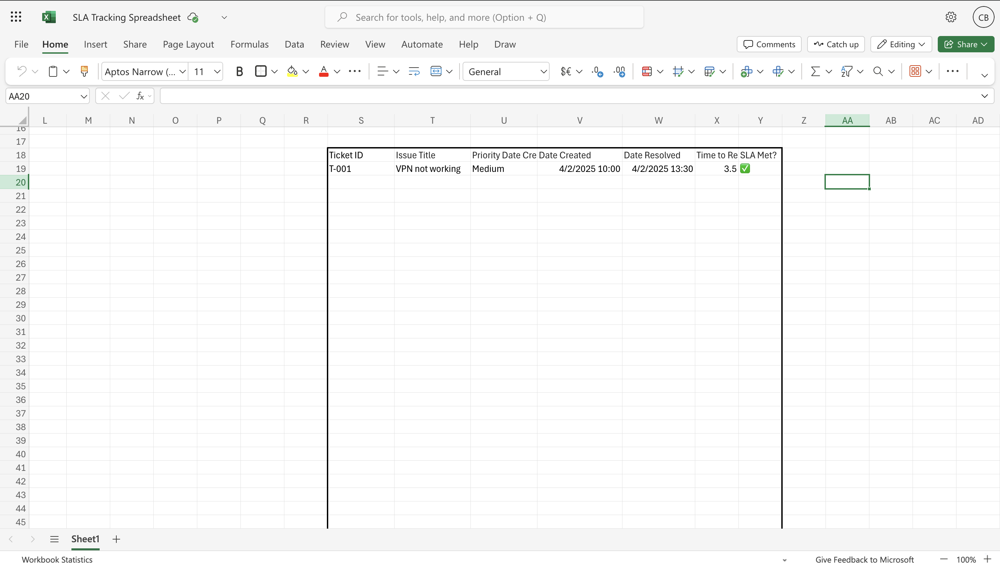

# 🖥️ IT Support SLA Tracker

A hands-on IT support project that simulates a real-world helpdesk environment. This tracker uses Python to automate SLA monitoring and Excel to visualize ticket trends and performance.

### 🔧 What it does
- Reads ticket data from a CSV
- Calculates how many days each ticket has been open
- Flags tickets that violate the SLA (open > 3 days)
- Outputs a list of overdue tickets
- Generates a clean Excel dashboard with pivot tables & charts to show:
  - Ticket priority breakdown
  - Technician workload
  - SLA performance (overdue vs on-time)

### 💡 Why I built this
To practice real IT operations work — including automation, data handling, and reporting — while creating a project I can show on my resume and GitHub. It blends IT support concepts, scripting, and business analytics.

### 🛠️ Tech used
- Python (pandas, datetime)
- Excel (pivot tables, conditional formatting)
- VS Code + terminal

### 📁 Project structure


<h2>Project Walk-Through:</h2>

<p align="center">
Created IT Support Ticket System Board on Trello: <br/>
 <br />

<br />
<br />
Created Lists Simulating Completion Stage and Cards Simulating Support Tickets:  <br/>
 <br />

<br />
<br />
Made Simulation Ticket(VPN Issue): <br/>
<br />

 <br />
 <br />
Placed it in UNASSIGNED List: <br/>
 <br />

<br />
<br />
Opened Ticket and Moved it to IN PROGRESS: <br/>
 <br />

 <br />
 <br />
Started Dialogue with Employee: <br/>
 <br />

<br />
<br />
Fixed Issue and Completed Dialogue with Employee: <br/>
 <br />

 <br />
 <br />
Moved Ticket to RESOLVED:  <br/>
 <br />

 <h2>📊 SLA Tracker (Excel):</h2>
 <p align="center">
Set up a SLA Tracking Sheet on Excel to Keep Track of Tickets:<br/>
<br />

  
 <h2>🧠 What I Learned:</h2>
 
- <b>How to simulate real-world IT support workflows</b>
- <b>SLA calculation and reporting</b>
- <b>Clear documentation and technical communication</b>
- <b>Applying ITIL concepts (incidents, priorities, and escalation)</b>
  
</p>

<!--
 ```diff
- text in red
+ text in green
! text in orange
# text in gray
@@ text in purple (and bold)@@
```
--!>
