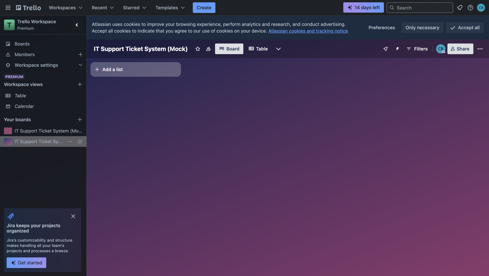
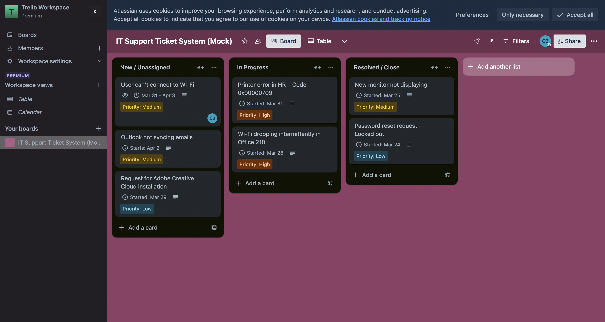
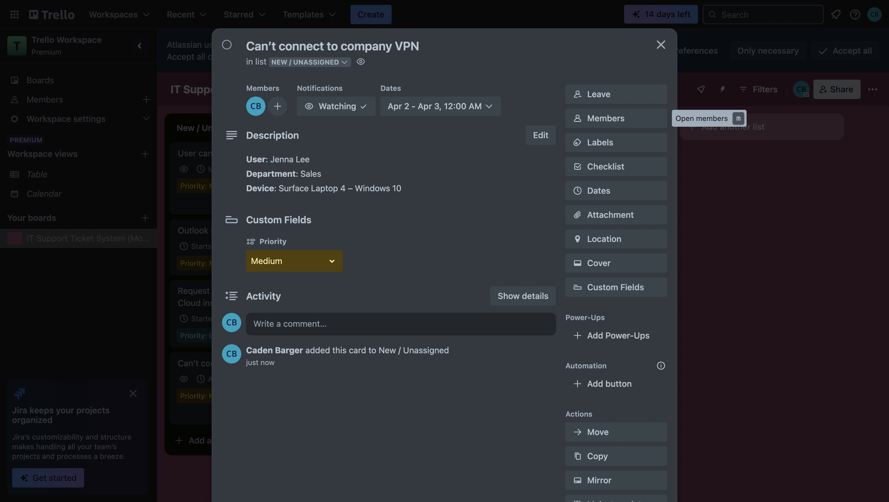
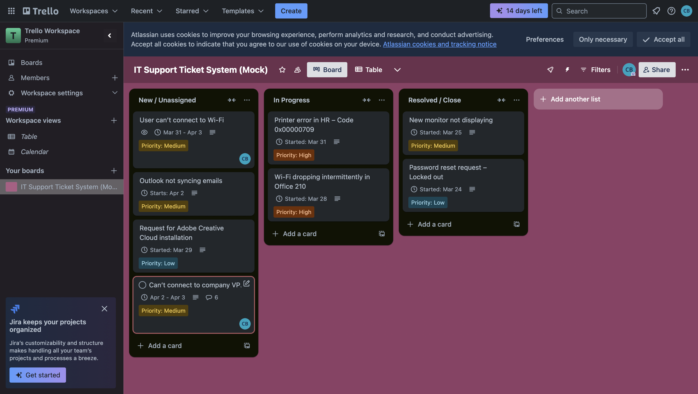
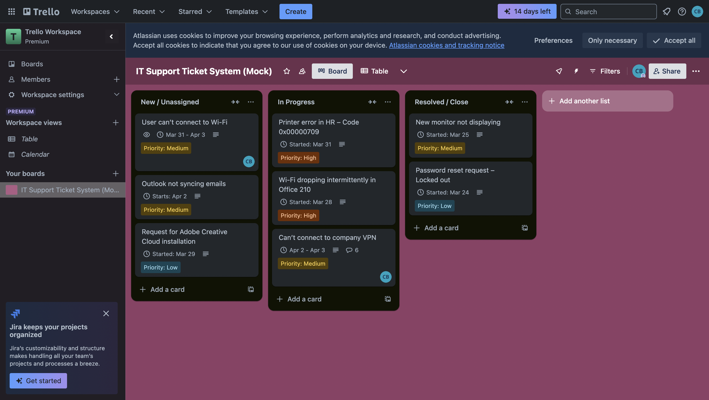
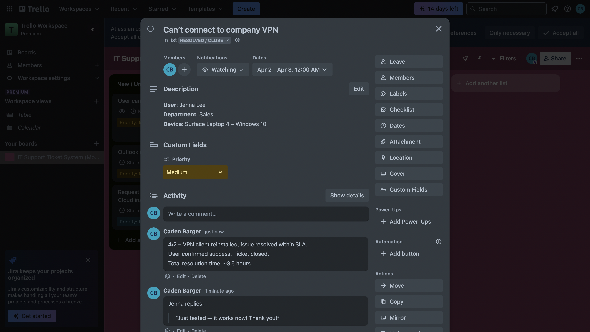
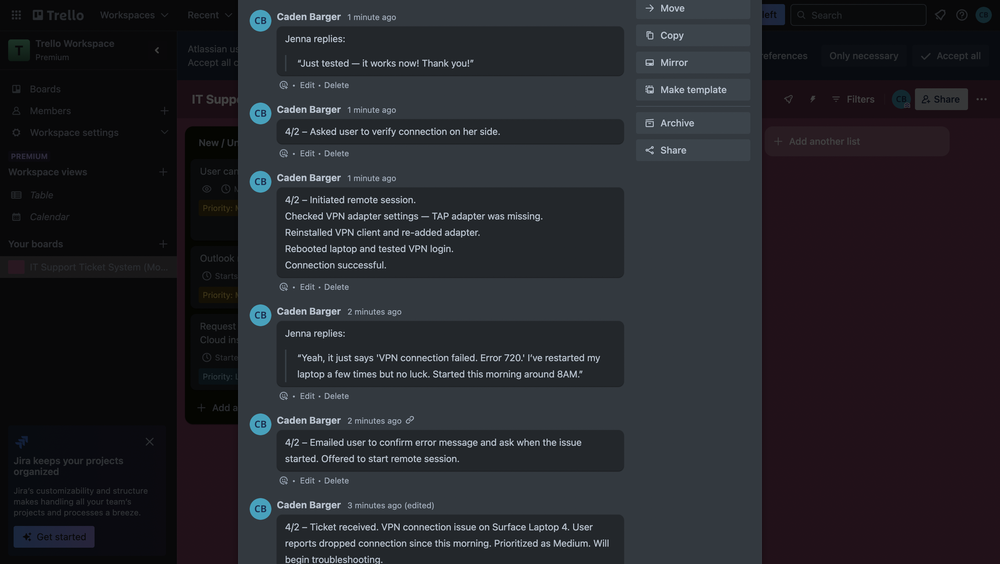
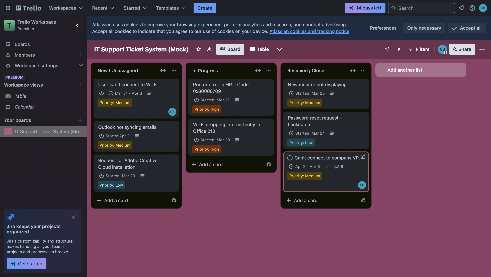

<h1>IT Support Ticket System (Mock)</h1>


<h2>Description</h2>
A hands-on project simulating a real IT help desk system, built using Trello and Excel. This project showcases workflow management, SLA tracking, and ITIL-based ticket handling — no internship required.

<br />


<h2>🔧 Tools Used</h2>

- <b>Trello: Ticket management & workflow simulation</b> 
- <b>Excel: SLA performance tracker with automated metrics</b>

<h2>✅ Features </h2>

- <b>🧾 Custom ticket board with stages: New, In Progress, Resolved</b>
- <b>🧍 Includes user info, priorities, device types, and SLA timelines</b>
- <b>🛠️ End-to-end troubleshooting example (VPN issue)</b>
- <b>📊 Excel-based SLA tracking with time-to-resolution formulas</b>
- <b>🎯 Simulated ITIL workflow: triage → troubleshoot → escalate → close</b>

<h2>Project Walk-Through:</h2>

<p align="center">
Created IT Support Ticket System Board on Trello: <br/>
 <br />

<br />
<br />
Created Lists Simulating Completion Stage and Cards Simulating Support Tickets:  <br/>
 <br />

<br />
<br />
Made Simulation Ticket(VPN Issue): <br/>
<br />

 <br />
 <br />
Placed it in UNASSIGNED List: <br/>
 <br />

<br />
<br />
Opened Ticket and Moved it to IN PROGRESS: <br/>
 <br />

 <br />
 <br />
Started Dialogue with Employee: <br/>
 <br />

<br />
<br />
Fixed Issue and Completed Dialogue with Employee: <br/>
 <br />

 <br />
 <br />
Moved Ticket to RESOLVED:  <br/>
 <br />

 <h2>📊 SLA Tracker (Excel):</h2>
<br/>
<br />

</p>

<!--
 ```diff
- text in red
+ text in green
! text in orange
# text in gray
@@ text in purple (and bold)@@
```
--!>
